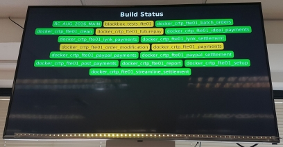
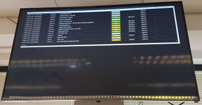
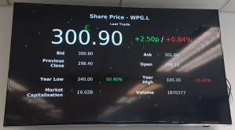
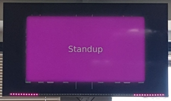

<h1 align="center">
    Build TV
</h1>

    <i>Setup a build TV / information radiator using a Raspberry Pi.</i>

    
    
    
    

    
    
    
    
    
    

## Features
- Display dashboards (external web-pages, HTML files and JIRA dashboards)
- Display timed notifications (stand-up time etc)
- Turn on/off TV at certain times
- Poll multiple instances of Jenkins and display build status of jobs
- Display share price
- Remote control through API (experimental)
- Control LED strip to display build status

## Getting Started
Refer to [getting started](docs/getting-started.md), which includes a prerequisites checklist.

## Docs
More documentation can be found in the [docs](docs/README.md).
