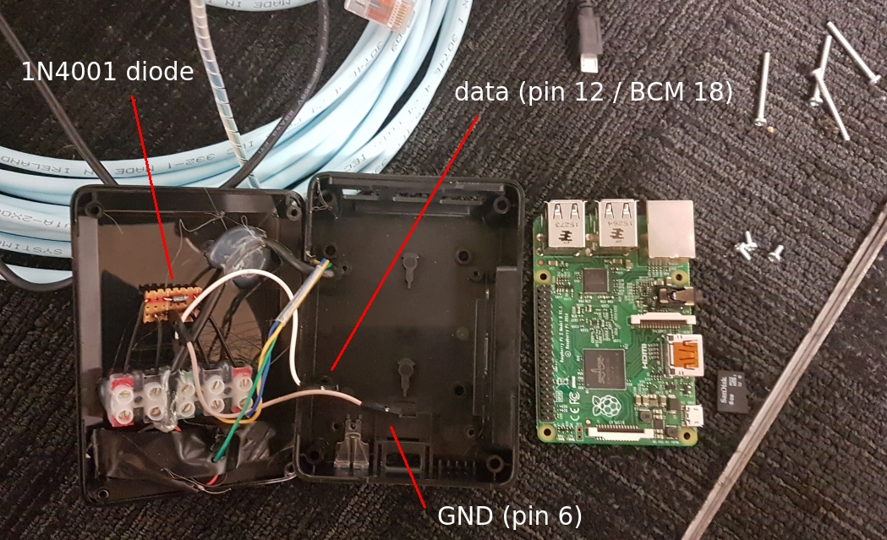
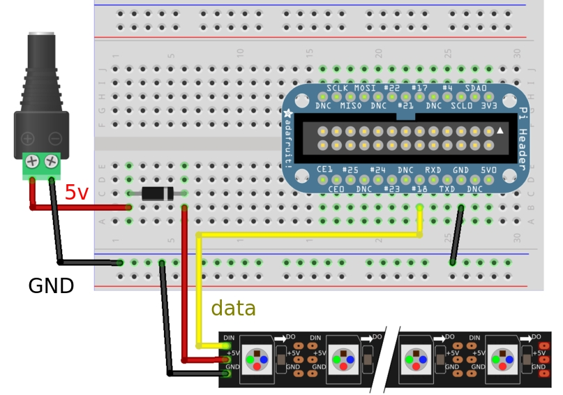

# Build Indicator
This project currently supports NeoPixel ws281x LED strips.

A useful resource on wiring:

<https://learn.adafruit.com/neopixels-on-raspberry-pi/wiring>

An approach tested on many devices is using a 1N4001 diode, as this is very cheap. Use the guide above, but in summary;
- Connect `din` (data in) from LED strip to GPIO pin on Raspberry Pi (pin 12 / BCM 18 by default).
    - <https://www.raspberrypi.org/documentation/usage/gpio/>
- Connect `5v` from LED strip to a diode, and then the diode to a 5v source.
- Connect `gnd` to ground source.

Recommendations:
- Do not use the `5v` from Raspberry Pi, as the power consumption could damage the board. Use an external power
  source.
- Ground should be connected to both the Raspberry Pi's ground and external power source's ground.

## Example

This is real-world example of using a 1N4001 diode.

An old USB cable has been split apart for its 5v and GND wires, connected to a USB plug, serving as an external
power source. This powers the LED strip independently of the Raspberry Pi. In some cases, it's possible to
use a USB port on the back of a TV, rather than a USB plug.

The schematic taken from Adafruit's tutorial:

Useful resources on pins for Raspberry Pi:
- <https://elinux.org/RPi_Low-level_peripherals>
- <https://pinout.xyz>
